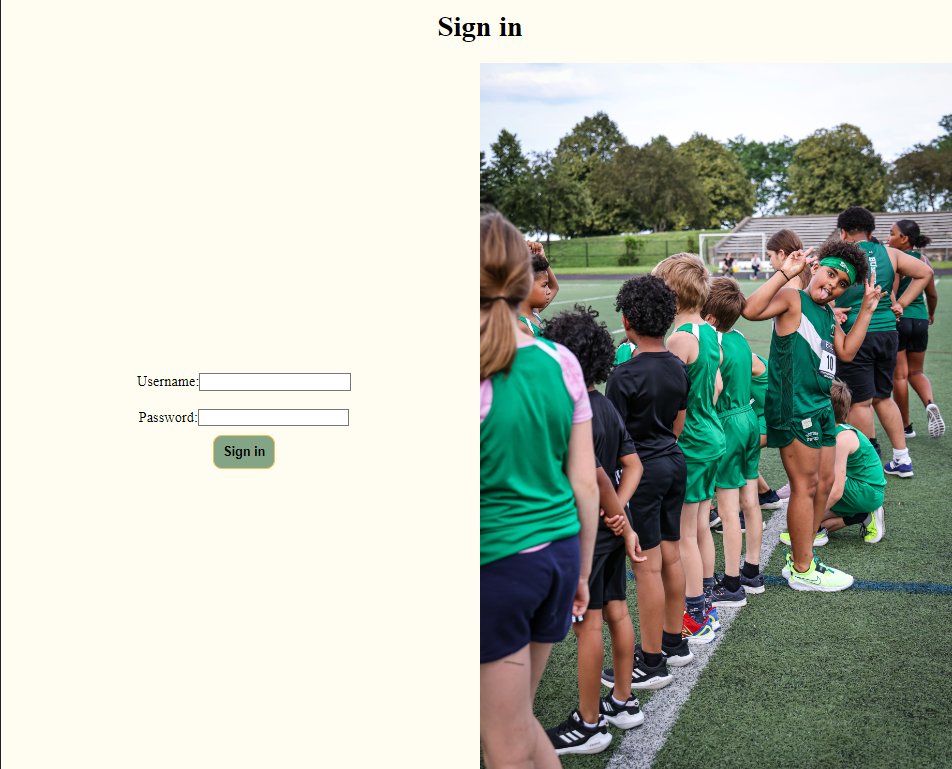

# Mai Sports App

This app provides the basic functionality needed to create events. It basic CRUD functionality with requirements for a user account to begin navigating the site.

With my work in youth sports, I wanted to create something that could potentially be used in the future when I support another sports nonprofit that may not have the overhead needed to use a subscription-based platform like LeagueApps.

## Getting started

[~ Click here and test out the app yourself ~](https://mai-sports-app-d294c921d0b5.herokuapp.com/)

Directions are included at the top of the game. You can forfeit the game at any time and start over. With 26 possible pairs, all you need is 14 points to make sure you win!

## Attributions

Photos are courtesy of the Boston United Track and Cross-Country Club [(link)](bostonunitedtrackclub.com).

## Tech used

* HTML
* JavaScript
* EJS
* Mongoose / MongoDB
* Express
* method Override
* morgan
* CSS

## Next steps

With the CRUD and basic CSS completed, I want to try to replicate many of the functions of LeagueApps, including the creation of club-teams so that individual users can sign up for different seasons.

I would also like to make it so that the account information would be similar to what is used for data to apply for future grants. The idea of this app is to allow for other sports teams to benefit from this work after all.